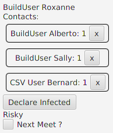
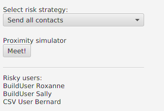

# Le projet StopCovid

 

Réalisé par **Julien Giraud** (P1704709) et **Ulysse Regnier** (P1711637)

## Présentation du projet

StopCovid est le prototype d'une application pour smartphone dont le but est de limiter au maximum la propagation du covid-19.  
Pour luter efficacement contre le virus nous informons les utilisateurs à risque qu'ils ont été en contact avec le virus, afin qu'ils limitent au maximum leurs interractions sociales en attendant de savoir s'ils sont contaminés.

## Aperçus

| Interface utilisateur | Interface serveur |
| --------------------- | ----------------- |
|  |  |

Sur notre prototype vous trouverez ces interfaces dans la même fenêtre.

| Interface | Description |
| --------- | ----------- |
| Utilisateur | Les utilisateurs disposent d'une interface sur laquelle il peuvent voir leur statut, se déclarer infecté, indiquer qu'ils sont en contact avec des personnes et supprimer des contacts.
| Serveur | Le serveur quant à lui peut décider que des utilisateurs suffisamment proches deviennent des contacts, il s'occupe de sauvegarder toutes les informations des utilisateurs et détermine grace à un algorithme paramétrable si certains utilisateurs sont risqués. |

## Lancer l'application

Malheureusement nous n'avons pas réussi à générer un `.jar` qui s'exécute sans problème (erreurs avec JavaFX), il faut donc lancer l'application depuis les sources.

1. Assurez-vous d'avoir **maven** et **openJDK 11** installé sur votre machine

2. Ouvrez un terminal dans le dossier stopcovid

3. Exécutez la commande suivante

    ```shell
    mvn clean install compile exec:java
    ```

## Design Paterns

Donner une motivation des choix d’architecture (et des patterns choisis) en s’aidant de **diagrammes simples** adaptés au degré de précision et au type d’explication. Donc des **diagrammes de classe, mais pas que** cela, et pas de plats de spaghettis générés automatiquement représentant tout le code.

Dans le cadre de ce projet nous avons mise en place pas moins de 5 design paterns qui ont chacun un role primordiale dans le bon fonctionnement de notre application.

### MVC

### Builder

```java
Controller controller = new ControllerBuilder()
        .addUser("a")
        .addUser("z")
        .addUser("e")
        .addUser("r")
        .addUser("t")
        .addUser("y")
        .build();
```

### Observer

### Strategy

### DAO

## Étique
