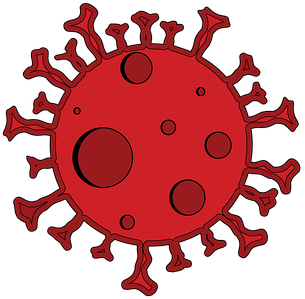

# Le projet StopCovid

 

Réalisé par **Julien Giraud** (P1704709) et **Ulysse Regnier** (P1711637)

## Présentation du projet

présentation globale du projet (rapide : ne répétez pas
l'énoncé)

## Lancer l'application

1. Assurez-vous d'avoir **maven** et **openJDK 11** installé sur votre machine

2. Ouvrez un terminal dans le dossier stopcovid

3. Entrez la commande suivante dans votre terminal

    ```shell
    mvn clean install compile exec:java
    ```

## Design Paterns

Donner une motivation des choix d’architecture (et des patterns choisis) en s’aidant de **diagrammes simples** adaptés au degré de précision et au type d’explication. Donc des **diagrammes de classe, mais pas que** cela, et pas de plats de spaghettis générés automatiquement représentant tout le code.

### MVC

### Builder

### Observer

### Strategy

### DAO

## Étique
