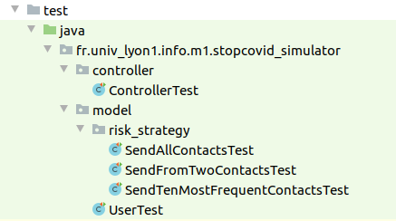

# Le projet StopCovid

 

Réalisé par **Julien Giraud** (P1704709) et **Ulysse Regnier** (P1711637)

## Présentation du projet

StopCovid est le prototype d'une application pour smartphone dont le but est de limiter au maximum la propagation du covid-19.  
Pour luter efficacement contre le virus nous informons les utilisateurs à risque qu'ils ont été en contact avec le virus, afin qu'ils limitent au maximum leurs interractions sociales en attendant de savoir s'ils sont contaminés.

## Aperçus

| Interface utilisateur | Interface serveur |
| --------------------- | ----------------- |
|  |  |

Sur notre prototype vous trouverez ces interfaces dans la même fenêtre.

| Interface | Description |
| --------- | ----------- |
| Utilisateur | Les utilisateurs disposent d'une interface sur laquelle il peuvent voir leur statut, se déclarer infecté, indiquer qu'ils sont en contact avec des personnes et supprimer des contacts.
| Serveur | Le serveur quant à lui peut décider que des utilisateurs suffisamment proches deviennent des contacts, il s'occupe de sauvegarder toutes les informations des utilisateurs et détermine grace à un algorithme paramétrable si certains utilisateurs sont risqués. |

## Lancer l'application

Malheureusement nous n'avons pas réussi à générer un `.jar` qui s'exécute sans problème (erreurs avec JavaFX), il faut donc lancer l'application depuis les sources.

1. Assurez-vous d'avoir **maven** et **openJDK 11** installé sur votre machine

2. Ouvrez un terminal dans le dossier stopcovid

3. Exécutez la commande suivante

    ```shell
    mvn clean install compile exec:java
    ```

## Design Paterns

Donner une motivation des choix d’architecture (et des patterns choisis) en s’aidant de **diagrammes simples** adaptés au degré de précision et au type d’explication. Donc des **diagrammes de classe, mais pas que** cela, et pas de plats de spaghettis générés automatiquement représentant tout le code.

Dans le cadre de ce projet nous avons mise en place pas moins de 6 design paterns qui ont chacun un rôle **primordial** dans le bon fonctionnement de notre application.

### Model View Controller (MVC)

Toute l'**architecture** de notre application est basée sur un MVC afin de bien séparer les différentes parties du code.

Notre MVC fonctionne de la façon suivante :

- Le _contrôleur_ a **accès** au _modèle_ et la _vue_ a accès au _contrôleur_.
- La _vue_ **demande** au _contrôleur_ les informations à **afficher**, le _contrôleur_ les récupèrent dans le _modèle_.
- Lorsqu'une **action** se produit sur la _vue_ (une rencontre par exemple), celle-ci **informe** le _contrôleur_ qui mettra à jour le _modèle_.
- *Il y a également un système de notification pour les mises à jour de la vue, il est détaillé à la suite de ce rapport.*


Ainsi les vues sont complètement indépendantes du modèle, mais sont quand même dépendantes.

```java
new MainView(stage, WIDTH, HEIGHT, controller);
new MainView(new Stage(stage.getStyle()), WIDTH, HEIGHT, controller);
```

Nous avons utilisé le code ci-dessus afin de vérifier le bon fonctionnement de notre MVC. Il permet d'instancier deux fenêtres de l'application StopCovid branchées sur le même contrôleur.  
Après utilisation, on constate que chaque modification faite sur l'une des deux fenêtres se retrouve instantanément faite sur l'autre, ce qui est logique puisqu'elles affichent les données du même modèle.

Conclusion, notre super MVC fonctionne !

### Observer

Une fois l'architecture MVC en place nous avions absolument besoin d'un pattern observer afin de gérer la mise à jour des composants graphiques.


Cette solution est vraiment indispensable car notre ancien système de mise à jour des vues était très mauvais en deux points.

- Il y avait des spaghettis d'appels de fonctions avec des noms différents.
- Le mécanisme utilisé se résumait à stocker des références de partout et parcourir toutes les vues afin de leur demander à toutes de se mettre à jour.

L'implémentation du pattern observer a permis de clarifier ces fonctions de mise à jour et de gagner en performance car nous ne mettons à jour que les composants graphiques qui ont besoin de l'être.

#### *L'anecdote de ce pattern*

> Nous avons tous les deux déjà utilisé le pattern observer avec Java dans le cadre d'un TP pendant notre DUT informatique, il y a deux ans. Nous venons seulement de comprendre que l'objectif de ces TP était de nous faire utiliser un système de notifications.  
> Mieux vaut trop tard que jamais !

Bilan du pattern, le code relatif aux mises à jour graphiques est plus facile à lire, plus performant et plus facile à maintenir que notre implémentation précédente.

### Data Access Object (DAO) et Singleton

Lorsque notre application démarre le contrôleur est instancié, il a alors besoin de récupérer la liste des utilisateurs du système depuis une base de données super sécurisée. Pour éviter au contrôleur de gérer cette partie, nous avons implémenté un DAO qui fonctionne en singleton.


Le DAO s'occupe d'établir une connexion sécurisée à la base de données du système et il offre des méthodes publiques pour interragir avec celle-ci, sans se préocuper du mécanisme de connexion ou du langage de requête.

Le singleton quant à lui permet de limiter les instances du DAO au nombre de une. Ainsi, un seul DAO est instancié et on ne fait qu'une seule connexion à la base de données.

L'avantage de cette méthode est qu'il est possible de changer de technologie de base de données sans modifier une ligne de code dans le contrôleur.

> Ça tombe plutôt bien car pour des raisons budgétaires nous avons dû nous résoudre à abandonner la base de données super sécurisée au profit d'un fichier CSV.

### Strategy

Notre classe modèle a besoin de mettre en oeuvre différents algorithmes afin de choisir quels utilisateurs sont risqués. Afin d'abstraire l'implémentation de ces algorithmes du point de vue de la classe User nous avons utilisé le pattern Strategy.


Ce pattern nous permet d'avoir autant d'implémentations que l'on veut pour l'algorithme, sans modifier une seule ligne de code dans la classe User.

```java
List<User> riskyUsers = riskStrategy.getRiskyContacts(this);
```

Concrètement la classe User se contente d'appeler la méthode `getRiskyContacts` sur un objet de type `RiskStrategy` (voir ci-dessus). Cet objet correspond systématiquement à une stratégie spécifique, sélectionnée par le serveur.

Ce pattern est redoutablement efficace pour abstraire différentes versions d'une même méthode, pour autant son implémentation se résume à une utilisation basique des interfaces Java.

### Builder

Pour des raisons évidentes de sécurité, nous avons une forte séparation du personnel qui travail sur notre application. Ainsi, les personnes chargées de gérer la base de données n'ont pas accès au code du contrôleur, et vice-versa. Cependant, à l'initialisation du contrôleur nous avions besoin d'ajouter des utilisateurs dans l'application, nous avons donc mis en place un builder sur le contrôleur afin de résoudre ce problème.


Plus sérieusement, nous avons mis en place le pattern builder sur le contrôleur afin de lui ajouter des utilisateurs depuis sa ligne de code d'initialisation.

```java
Controller controller = new ControllerBuilder()
        .addUser("Sally")
        .addUser("Roxanne")
        .addUser("Alberto")
        .build();
```

En réalité ce pattern n'est pas du tout essentiel au bon fonctionnement du projet, mais c'est une solution élégante et pratique pour ajouter les utilisateurs au _contrôleur_. Nous en avons également profité pour utiliser la méthode de sauvegarde de notre DAO. En effet, les utilisateurs rajoutés par le builder sont automatiquement sauvegardés dans le fichier CSV à condition d'en informer le builder avec un `.build(true)`.

## Tests

Pour la bonne conception de ce projet, nous avons mis en place des séries de tests par _packages_. Une classe de tests correspont donc à tous les tests effectués sur la classe correspondante.



Nous avons donc effectué des tests pour chaque fonctionnalité, permettant de vérifier que tout fonctionnait comme nous le voulions. Cela nous a parfois permis de trouver des erreurs dans notre code. Il y a à ce jour 26 tests qui permettent de tester chaque fonctionnalités du _contrôleur_ et des _modèles_.

Ces séries ne sont évidemment pas complètes, car il y aura toujours des tests à ajouter. En commençant par les tests de la _vue_ mais aussi en testant toutes les possibilités entre les _packages_. Nous avons bien entendu tout de même opéré à un certain nombre de tests manuels pour la _vue_.

Les tests impliquent aussi le checkstyle utilisé. Celui-ci nous a permis de garder un code très propre **tout le long du développement**. Personnellement, c'était la première fois que nous l'utilisions. Ce projet nous a convaincu de son utilité et de sa praticité. C'est par ailleur grâce à cela que pouvons aujourd'hui facilement créer une javadoc.

## Éthique

### Possibles améliorations

Ce projet pose un certains nombre de questions éthiques. En effet, les utilisateurs ont le droit de garder privé le fait d'être infecté par le virus, ainsi que leur identité bien-sûr.

Notre version mériterais certaines améliorations de ce point de vue. En effet, la vue utilisateur affiche les noms de chaque contact. Pour respecter les droits de chacun, seul les identifiants pourraient être affichés. Cependant, nous avons fait en sorte qu'il n'y ait aucun moyen de savoir qui est infecté dans les contacts d'un utilisateur.

Pour garder les informations personnels des utilisateurs en sécurité, la base de donnée de l'application doit être bien sécurisée afin de prévenir les potentielles attaques qui dévoileraient des données confidentielles.

Autant vous dire qu'avec un fichier CSV, c'est loin d'être optimal. Les données pourraient être stockées dans une base de donnée sécurisée. Cela augmenterais par ailleurs la rapidité de l'accès aux données. Nous avons tout de même mis en place le pattern DAO comme expliqué plus tôt. Grâce à cela, il est facile de changer de système de stockage des données dans le code.

Même si les données restaient confidentiels à la vue du public, nos employés gérant le serveur ont accès à toutes ces données. Une amélioration possible serait d'avoir simplement accès à la liste des utilisateurs par identifiant, mais pas leur contacts ni leur nom. Il est possible de réaliser cela en ajoutant une couche contrôleur supplémentaire entre le serveur et les utilisateurs.

### Les futures questions

Notre application n'est pas complète, pour l'instant il s'agit en effet d'un simulateur qui n'utilise pas de véritables données pour créer la liste des contacts d'un utilisateur. Elle est pourtant prévue pour, à terme, être utilisé dans des conditions réelles et créer la liste de contacts en fonction des déplacements des utilisateurs. Cela créer de nouvelles questions en terme d'éthique et de données confidentielles.

La position des utilisateurs ne devrait pas être utilisée, car il ne serait probablement pas efficace de vérifier la position de chaque utilisateur à tout moment. Mais cela engendrerait le fait de devoir sécurisée une donnée très sensible. Le protocole **Robert**, utilisé par la véritable application StopCovid _(oups)_, utilise le protocole bluetooth. Cela règle les questions concernant la position géographique mais n'empêche pas les utilisateurs de lié un appareil proche à un utilisateur. A voir si un autre protocole devrait être utilisé ?

Il est, d'après nous, nécéssaire que l'application prévienne que tout le monde n'utilise pas forcément l'application. Afin de faire comprendre à l'utilisateur que même si l'application ne signal aucun contact infecté, il est possible qu'il ait été en contact avec une personne infectée qui ne possède pas l'application.